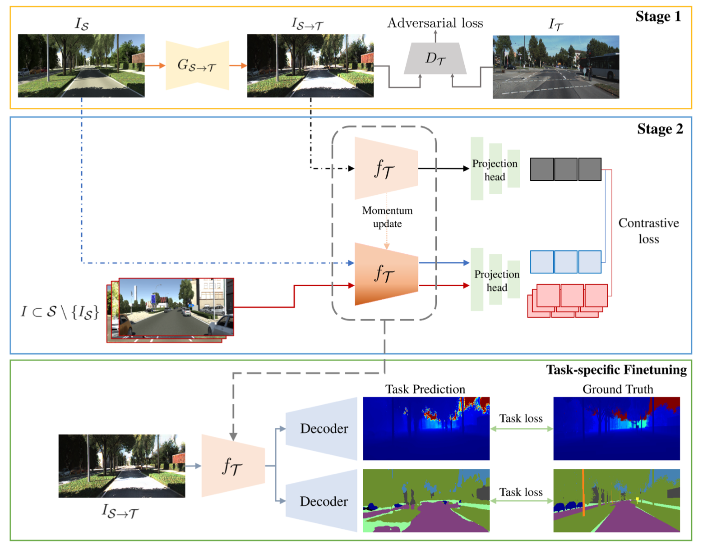

## Learning a Domain-Agnostic Representation for Autonomous Driving via Contrastive Loss
### IEEE IROS 2021 Submitted
This repo provides an official PyTorch implementation of DACL submitted in IEEE IROS 2021 and offers pretrained encoders, and depth estimation and semantic segmentation networks.

### Overview
<p align="center">
	
</p>

### Setup
It is recommended to create a new Anaconda virtual environment for reproduction or evaluation with pretrained models.


```bash
conda create -n dacl python==3.6.5
conda activate dacl
conda install pytorch=1.6.0 torchvision=0.5.0 -c pytorch
```

We ran our experiments with PyTorch 1.6.0, CUDA 10.2, Python 3.5.6 and Ubuntu 18.04. Usage of higher or lower version of PyTorch seems to be incompatible to our pre-trained model.

```bash
pip install pillow==7.2.0 opencv-contrib-python==4.4.0.42
```
If you do not use Anaconda environment, please use pip3 rather than pip for dependencies with Python3.

### Stage 1: Style Transfer
